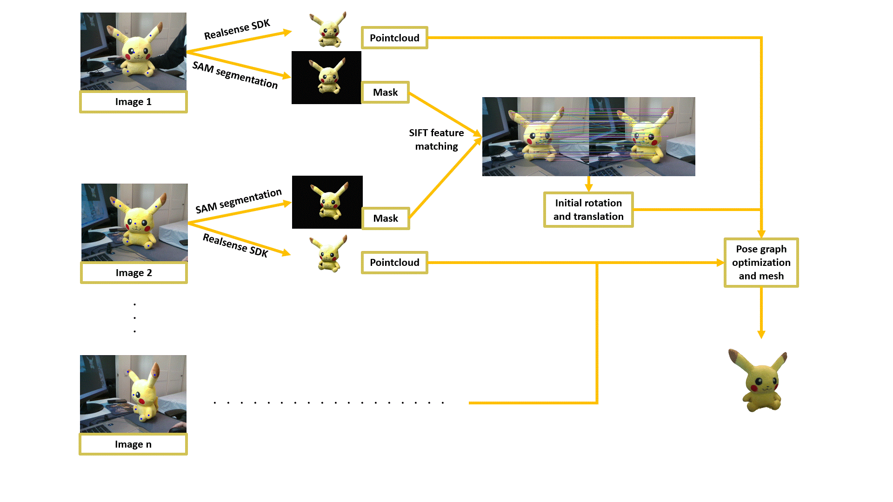

<!---->

   

# 3D RECONSTRUCTION PROJECT USING REALSENSE SDK CAMERA

This repository contains software to perform 3D reconstruction (merged pointcloud and mesh) by using the Realsense D435 camera to take images and pointclouds thanks to the stereo capabilities of the camera. I created a Python and C++ version. The C++ version has been tested on Nvidia Jetson AGX Orin. The steps are as follows:

1. Each captured image is segmented using [SAM 2.1](https://github.com/facebookresearch/sam2) to isolate the object whose pointcloud should be extracted.

2. The camera also provides a depthmap. We convert this depthmap into a pointcloud by taking those points lying inside the mask.

3. Each pair of consecutive images are matched using SHIFT feature matching. Since we know the intrinsic parameters of the camera, and also the depth of each point (thanks to the stereo), we can calculate an initial approximation of the rotation and translation between one object and the next.

4. Once the pointclouds and the initial guesses of rotations and translation are calculated, we perform a PoseGraph optimization algorithm to build a final version of the pointcloud, taking into account loop closures to improve the overall matching. This provides a final merged pointcloud.

5. From the merged pointcloud, we create the mesh like those represented by the GIFs at the beginning of this sheet. Pretty cool, right?

These steps are represented in the following main scheme. There are also various substeps, and I will highlight some of the most important, specially if they help making proper use of the programs provided.

